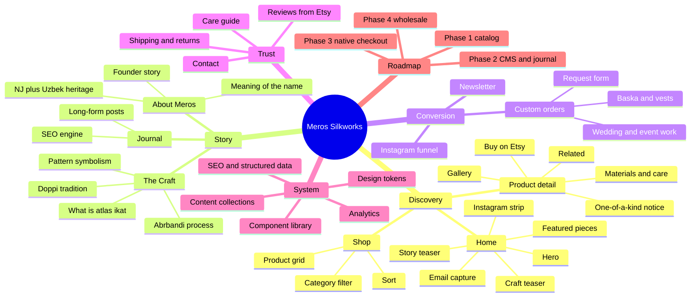
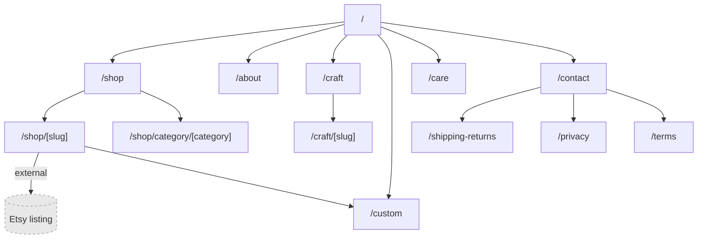
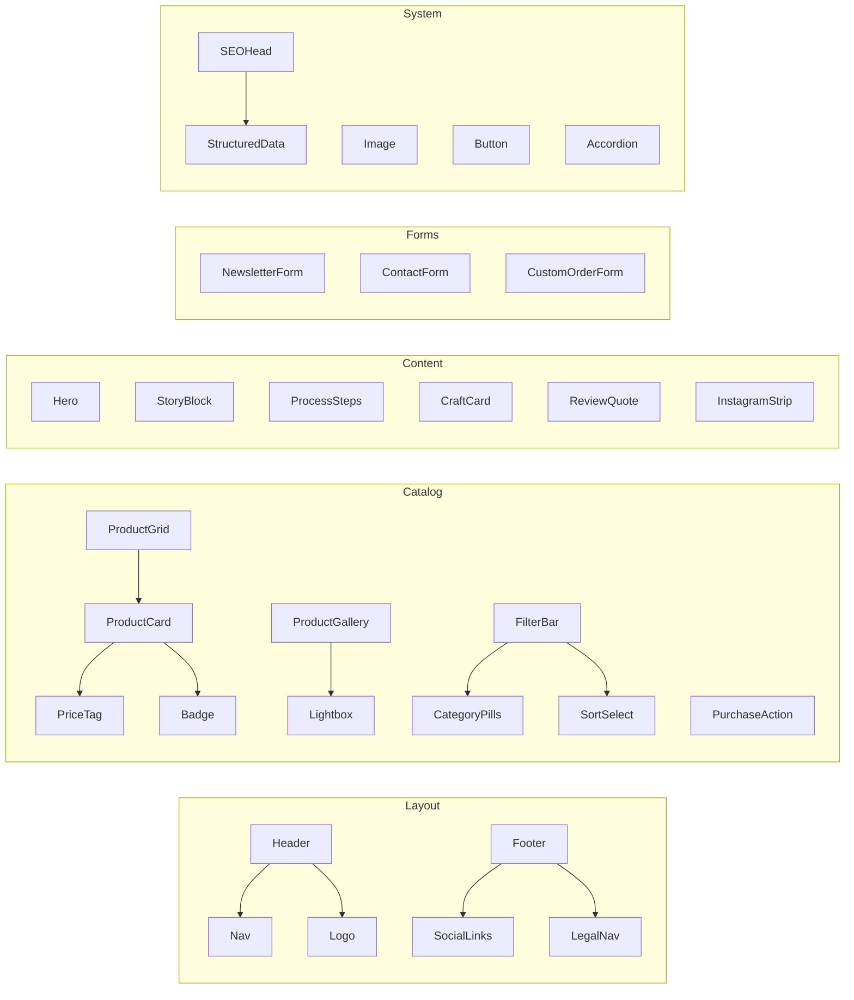
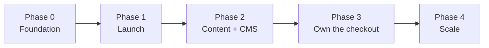

# (# Meros Silkworks — Site Architecture

**Build brief. Architecture only — no implementation code.**
Feed this document to a build session as the source of truth.

---

## 0. Context

| | |
|---|---|
| **Brand** | Meros Silkworks |
| **Tagline (existing)** | Rooted in Tradition. Designed for now. |
| **Name meaning** | *Meros* (Uzbek) = inheritance / heritage. This is the conceptual spine of the whole site. |
| **Product** | Handmade accessories and apparel from Uzbek atlas/ikat silk |
| **Maker** | Solo founder, New Jersey, USA. Uzbek heritage. |
| **Current channel** | Etsy — 5.0★ (15 reviews), 50 sales, ~11 months live, 8 active listings |
| **Also on** | Instagram |
| **Domain** | merossilkworks.com — owned |
| **Deployment** | GitHub (Pages or Vercel/Netlify connected to repo) |

### Current catalog (baseline data seed)

| Item | Price | Category |
|---|---|---|
| Doppi Hair Ties | $10 | Hair |
| Atlas/Ikat Scrunchies | $12 | Hair |
| Atlas/Ikat Printed Earrings | $12 | Jewelry |
| Atlas/Ikat hair bow | $20 | Hair |
| Atlas/Ikat bag charm / ribbon | $20 | Accessories |
| Embellished Atlas/Ikat Hat | $30 | Apparel |
| Atlas/Ikat Neck Scarf | $50 | Scarves |
| Atlas/Ikat Vest | $60 | Apparel |
| Atlas/Ikat Custom Baska (Basque Skirt) | $55 | Custom / Apparel |

Price band: **$10–$60.** Low AOV, impulse-friendly, gift-friendly. This shapes everything below.

---

## 1. Strategic decisions (decide these before building)

### 1.1 Commerce model → **Catalog-first, Etsy-fulfilled (Phase 1)**

Do **not** build a native checkout at launch.

**Why:**
- 50 sales / 11 months. Custom checkout infrastructure is disproportionate to volume.
- Her 5.0★ / 15 reviews live on Etsy. That social proof is a real asset and doesn't transfer.
- Zero payment/tax/fraud/refund infrastructure to maintain — she's a solo maker, not an ops team.
- Etsy handles sales tax nexus across states. Rebuilding that is a genuine burden.

**Architecture implication:** every product object carries an `etsyUrl`. The site's job is **discovery, story, and trust** — the transaction is a deep link out. Build the product page so the CTA is a swappable slot, so Phase 3 can drop in a real cart without restructuring.

**Trade-off to acknowledge:** you don't own the customer, you pay Etsy fees, and you lose checkout analytics. That's the correct trade at this volume, and the mitigation is the email list (section 6).

### 1.2 Stack → **Astro, static output**

**Why Astro over Next.js:** this is a content + catalog site, not an app. Astro ships near-zero JS by default, has first-class content collections with schema validation, native image optimization, and deploys as static files to GitHub Pages for free. Next.js is the right answer only if Phase 3 native commerce is certain and imminent.

**Alternative if you'd rather:** Next.js static export. Same architecture, more JS. Don't use a SPA framework with client-side routing — SEO is a primary channel here.

### 1.3 Content editing → **Git-based CMS (Decap or Sveltia)**

She must be able to add a product without touching code or messaging you. Git-based CMS gives her a web admin UI that commits to the repo — no database, no monthly cost, no separate hosting.

**Why not Sanity/Contentful:** external dependency and a free-tier ceiling for something that is fundamentally 8–30 markdown files.

**Why not "just send Nadir the info":** it makes you a permanent bottleneck and the site goes stale the first month you're busy.

### 1.4 Language → **English at launch, architected for UZ/RU**

Primary market is US retail + the Uzbek/Russian-speaking diaspora concentrated in NJ/NY. Set up the route structure and content collection schema for i18n now (`/[locale]/...`), ship English only. Retrofitting i18n is expensive; reserving the shape is free.

---

## 2. Mindmap



---

## 3. Sitemap & routes



| Route | Type | Priority | Phase |
|---|---|---|---|
| `/` | static | P0 | 1 |
| `/shop` | static | P0 | 1 |
| `/shop/[slug]` | dynamic from collection | P0 | 1 |
| `/shop/category/[category]` | dynamic | P1 | 1 |
| `/about` | static | P0 | 1 |
| `/craft` | index | P1 | 2 |
| `/craft/[slug]` | dynamic from collection | P1 | 2 |
| `/custom` | static + form | **P0** | 1 |
| `/care` | static | P2 | 1 |
| `/contact` | static + form | P0 | 1 |
| `/shipping-returns` `/privacy` `/terms` | static | P2 | 1 |
| `/404` | static | P2 | 1 |

**Primary nav (confirmed):** Shop · Custom · About · Craft · Contact. Custom sits at top level, not nested under Shop — it's a confirmed volume driver for the business, not a secondary offering.

---

## 4. Page specifications

### 4.1 Home `/`

Single job: **make a stranger understand in five seconds that this is real handwoven Uzbek silk, not printed polyester from a dropshipper.**

| Block | Contents | Notes |
|---|---|---|
| Hero | Full-bleed macro of the ikat weave edge + tagline | Lead with the *fabric*, not a model. The feathered dye bleed is the most characteristic image in this world. |
| Featured | 3–4 pieces, mixed price points | Include one $10–12 entry item and one $50–60 anchor |
| Story teaser | 2–3 sentences on *meros* = inheritance → `/about` | The name is the hook; explain it early |
| Craft teaser | Abrbandi process, 3 steps, → `/craft` | This is the moat vs. mass-produced competitors |
| Custom/event CTA | "Wedding or event piece? Let's talk." → `/custom` | Confirmed real revenue driver — give it a real block, not a footnote |
| Reviews | 2–3 pulled from Etsy, with attribution | Manual copy at launch; 5.0★/15 is worth surfacing |
| Instagram strip | Latest 4–6 posts | Static-embed or manually curated; avoid heavy JS widget |
| Email capture | Single field, honest promise | "New pieces and restocks. A few times a year." |

### 4.2 Shop `/shop`

- Grid, 2-up mobile / 3-up desktop
- **Categories:** Hair · Jewelry · Accessories · Scarves · Apparel · Custom
- **Sort:** Newest, Price low→high, Price high→low
- **Card:** image (hover → second image), title, price, "One of a kind" badge where applicable
- **Empty state:** if a category is sold out, invite a custom request rather than showing nothing

### 4.3 Product `/shop/[slug]`

The most important page. Structure:

1. **Gallery** — minimum 3 images: full product, on-body/in-use, macro of the weave
2. **Title + price**
3. **One-of-a-kind notice** — *critical for ikat:* pattern placement varies per piece because it's cut from handwoven yardage. Setting this expectation up front prevents "it doesn't match the photo" disputes.
4. **Short description** — 1–2 sentences, sensory
5. **Buy on Etsy** — primary CTA, opens in new tab, tagged with UTM
6. **Details accordion** — Materials · Dimensions · Care · Fabric origin
7. **The story of this pattern** — optional short block where a piece has a named traditional motif
8. **Related pieces** — 3, same category or same fabric run

**Component slot note:** the CTA must be an isolated component (`<PurchaseAction>`) so Phase 3 can swap Etsy link → cart button in one file.

### 4.4 About `/about`

Her story, in her voice, first person. Photo of her — face, hands, or workspace. Cover: what *meros* means and why she chose it, growing up between NJ and Uzbek tradition, why she started, what she wants the pieces to do. This page converts more than any product copy will.

### 4.5 The Craft `/craft`

Educational hub. This is the **SEO engine and the differentiator**. Launch posts:

- What is atlas / ikat — and why it looks like that
- Abrbandi: the resist-dye process, step by step
- The doppi: what the cap means and when it's worn
- How to tell handwoven ikat from printed imitation
- Caring for silk atlas

### 4.6 Custom `/custom`

**Confirmed P0.** Saida needs volume from this, not just occasional overflow work — it's treated as a core revenue line, same weight as the shop, not a page tucked away for the rare inquiry.

The Baska skirt was custom and is currently unavailable — that's a demand signal, not a dead listing. Uzbek weddings and events are a real, high-AOV market.

Form fields: name · email · piece type · event date · fabric preference · size notes · budget range · reference images.

Because this page needs to actually convert traffic into inquiries (not just exist), give it the same production quality as a product page: a short gallery of past custom pieces if she has any, and realistic turnaround-time expectations up front — nothing kills a custom inquiry faster than the customer not knowing if 3 weeks or 3 months is normal.

### 4.7 Supporting pages

- `/care` — silk care, expandable into a printed insert card
- `/contact` — form + Instagram + response-time expectation
- `/shipping-returns` — mirror Etsy policy exactly; contradictions cause disputes
- `/privacy` `/terms` — required for analytics + email capture

---

## 5. Component inventory



**Total: ~24 components.** Anything beyond this at Phase 1 is over-building.

---

## 6. Data model

### Product (content collection entry)

```
slug              string, required, unique
title             string, required
category          enum: hair | jewelry | accessories | scarves | apparel | custom
price             number, required
currency          string, default "USD"
etsyUrl           url, required (Phase 1)
images            array of { src, alt, type: primary|onbody|detail }
shortDescription  string, max ~160 chars
longDescription   markdown
materials         string
dimensions        string, optional
care              string
fabricOrigin      string, optional — leave unset until sourcing is verified with Saida; do not default to a guessed region
patternName       string, optional
isOneOfAKind      boolean, default true
inStock           boolean, default true
featured          boolean, default false
collection        string, optional (fabric run / drop)
tags              array of string
publishedAt       date
```

### Craft post

```
slug · title · excerpt · coverImage · body (markdown) · publishedAt · tags · relatedProducts[]
```

### Review (manual, Phase 1)

```
quote · author · rating · sourceUrl · date
```

---

## 7. Design direction

**Explicit anti-brief.** The default output for "Uzbek artisan silk brand" is cream background + high-contrast serif + terracotta accent. Do not build that. It's the generic artisan-craft template, it appears regardless of subject, and it actively fights the product: **atlas ikat is maximalist and saturated — magenta, emerald, cadmium yellow, deep indigo.** A muted beige site makes the fabric look like a mistake.

### Direction: quiet canvas, loud cloth

The interface is near-silent so the textile carries every bit of color. All chroma on the page comes from photography.

| Token | Value | Role |
|---|---|---|
| `--canvas` | near-white, very slightly warm | Page background |
| `--ink` | deep near-black, slight blue cast | Text |
| `--rule` | 8–10% ink | Hairlines, dividers |
| `--muted` | 55% ink | Captions, metadata |
| `--accent` | pulled per-page from the featured piece's dominant dye | Never a fixed brand color — it changes with the cloth |

The moving accent is a real decision, not a gimmick: it mirrors how ikat itself has no fixed palette, only fixed technique.

### Type

Two roles minimum. Display face with genuine character used sparingly at large sizes; body face plain and highly legible at small sizes. **Avoid:** Playfair, Cormorant, generic high-contrast Didone — they're the templated artisan default. Consider a display face with slightly irregular or asymmetric forms that echo the hand-dyed edge, and set it tight.

### Signature element

**The bleed.** Abrbandi's defining artifact is the feathered edge where dye migrates along the warp — that soft-shattered boundary is what makes ikat instantly recognizable. Use it as the site's one structural motif: section transitions, image reveals on scroll, hover states on product cards, the 404. One idea, executed precisely, everywhere. Nothing else decorative.

### Quality floor

Responsive to 360px · visible keyboard focus · `prefers-reduced-motion` respected · alt text on every product image (also SEO) · AA contrast minimum.

---

## 8. SEO & growth

### Structured data
- `Product` schema on every product page (name, image, description, offers, price, availability)
- `Organization` + `LocalBusiness` (New Jersey) on home
- `Article` on craft posts
- `BreadcrumbList` sitewide

### Target queries
| Intent | Examples |
|---|---|
| Product | uzbek ikat scrunchie · atlas silk scarf · handmade ikat earrings |
| Cultural | what is doppi · uzbek atlas fabric meaning · abrbandi weaving |
| Occasion | uzbek wedding accessories · nikoh outfit accessories |
| Local | uzbek handmade new jersey |

The cultural queries have low competition and high intent — that's what `/craft` is for.

### Technical
Sitemap · robots.txt · canonical URLs · OG + Twitter cards per product (image = primary product shot) · WebP/AVIF with explicit dimensions · Lighthouse ≥95 on static pages.

### Email
Free tier (Buttondown or ConvertKit). Capture on home, product pages, and post-custom-inquiry. **This is the hedge against Etsy dependency** — it's the one owned channel in Phase 1.

---

## 9. Repo structure

```
meros-silkworks/
├── src/
│   ├── components/       # by domain: layout/ catalog/ content/ forms/ system/
│   ├── layouts/
│   ├── pages/
│   ├── content/
│   │   ├── products/     # one .md per product — the CMS writes here
│   │   ├── craft/
│   │   └── config.ts     # schema validation
│   ├── styles/           # tokens.css + global.css
│   └── lib/
├── public/
│   ├── images/products/
│   └── admin/            # Decap CMS config
├── astro.config.mjs
└── README.md
```

**Deploy:** GitHub Actions → GitHub Pages (free, custom domain supported), or connect Vercel/Netlify to the repo for preview deploys per PR. Branch protection on `main` once she has CMS access, so her edits land as commits you can see.

---

## 10. Roadmap



**Phase 0 — Foundation**
Repo · design tokens · layout shell · content collection schemas · deploy pipeline

**Phase 1 — Launch (MVP)**
Home · Shop · Product pages · About · Custom form · Contact · legal pages · SEO base · analytics · **9 products seeded, all linking to Etsy**

**Phase 2 — Content & autonomy**
Decap CMS wired up · `/craft` with 3–5 posts · newsletter live · Instagram integration · reviews block

**Phase 3 — Add a second channel (confirmed permanent, not a migration)**
Swap `<PurchaseAction>` to also offer Stripe Payment Links or Shopify Lite alongside the Etsy link · cart · order confirmation email. Saida confirmed this is side-by-side forever, not a graduation off Etsy — so `etsyUrl` stays a required field on every product indefinitely, never deprecated.

**Phase 4 — Scale**
Wholesale/stockist inquiry flow · UZ/RU locales · lookbook per fabric drop · gift cards

---

## 11. Decisions (confirmed with Saida)

| # | Question | Decision | Architecture impact |
|---|---|---|---|
| 1 | Domain? | Owned — merossilkworks.com | Deploy straight to it, no domain-buying step in Phase 0 |
| 2 | Fabric origin/sourcing? | Unconfirmed / not treated as important by Saida | Do **not** put a specific region claim (e.g. "Fergana Valley") anywhere in copy. `fabricOrigin` stays unset. Use generic, true-by-default language: "traditional Uzbek atlas ikat." Revisit if she later confirms real sourcing — it's worth adding then (see §0 reasoning: it's a genuine trust/pricing lever at this price point, just not one to fabricate). |
| 3 | Replace Etsy or run alongside? | **Permanent side-by-side.** Not a migration. | `etsyUrl` is a required field forever, not a Phase-1-only crutch. Phase 3 *adds* a second checkout option; it never removes the Etsy link. |
| 4 | Journal or fixed pages? | Fixed set, written once now, structured so it can grow later | `/craft` stays a content collection (not hardcoded HTML) so adding posts later is just adding files — no rebuild needed to go from "evergreen pages" to "journal" |
| 5 | Personal visibility? | Yes — face, name, story, on the site | `/about` is written first-person with a real photo; this page is expected to convert, not just decorate |
| 6 | Custom/wedding volume? | **Real, needed volume** — not overflow work | Elevated to P0, top-level nav item, home page gets a dedicated CTA block (see §4.1, §4.6) |
| 7 | Photography beyond Etsy shots? | New photos coming | Phase 1 build can proceed on placeholders/Etsy shots; swap-in when photos land. Don't let this block Phase 0–1 architecture work — it only gates final visual QA. |

---

## 12. What this document deliberately excludes

No component code, no CSS, no config files, no copywriting. Design tokens are described by role and intent rather than fixed hex values, so the build session makes them concrete against real product photography — locking exact colors before seeing the fabric on-screen is premature.)
